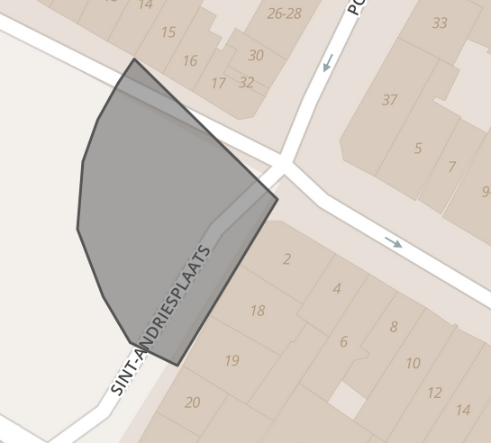
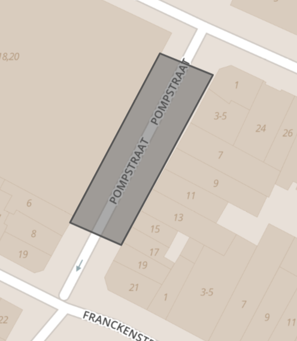

Document version 
====================

| Version | Date       | Comments     | Name and organisation |
|---------|------------|--------------|-----------------------|
| 0.2     | 05/08/2019 | First review | Bruno Herman, IMEC    |
| 0.1     | 15/06/2019 | draft        | Bruno Herman, IMEC    |
|         |            |              |                       |

Introduction
============

The main output of the cityflows data aggregation model are counts together with
a traffic flow, expressed per modality, for street segments. Pedestrians are
also taken as a specific modality. Input can also be viewed as a traffic flow,
although not necessarily in streets, but in larger or smaller areas. The input
can also measure several modalities at once while the output aims to provide
streams split up for each modality.

This document aims to provide information for

1.  a smooth integration of input sources, ready to be fed into the CityFlows
    service.

2.  a standardized representation of output of Cityflows, ready to be ingested
    by other services.

Input
=====

Required data fields
--------------------

The data sources that will be fed into CityFlows should adhere to a few data
standards.

Summary of functional required data fields:

| Name           | Description                                                          | Formatting / unit             | Required/Optional         | Example                                   |
|----------------|----------------------------------------------------------------------|-------------------------------|---------------------------|-------------------------------------------|
| Id             | Unique Identifier of measuring device or data source                 |                               | Required                  |                                           |
| Timestamp      | Timestamp of the registred event/count                               | ISO 8601UTC                   | Required                  | 2019-06-30T13:45:05Z                      |
| Count          | Count of the number of                                               | Integer or Float              | Required                  |                                           |
| Count_unit     | People, vehicles, groups, ...                                        |                               | Required, default unknown |                                           |
| Type_count     | Either event-like or interval-like                                   | E for event I for Interval    | Required                  |                                           |
| Locationrange  | Polygon indication the area where the measured values where observed | GeoJSON, coordinates in WGS84 | Required                  |                                           |
| Modality       | Car, Truck, Public Transport, Bicycle, Pedestrian, Other             |                               | Optional                  |                                           |
| Direction      | Direction of measured flow. Measured in degrees                      | integer                       | Optional                  |                                           |
| Speed          | Speed of measured flow                                               | Kilometer / hour              | Optional                  |                                           |
| Magnitude flow | Magnitude of measured flow                                           | \#units / s                   | Optional                  | Only meaningful when a direction is given |
| Accuracy       | Indication of the accuracy of the measurement                        | Float in %                    | Optional                  |                                           |

-   **Id**: unique identifier

-   **Timestamp**: used to mark to date and time of the measured count. This can
    either be

    -   an exact timestamp if the datastream is event-like. For example, a
        record denoting each passing vehicle with an exact timestamp and count
        1.

    -   a timestamp denoting the beginning of an interval. For example, a
        wifi-scanning device reporting number of unique devices seen every 10
        minutes.

-   **Count**: denoting the number of items counted

    -   In the interval if the datastream is interval-like

    -   A fixed number in case the datastream is eventlike (typically 1)

-   **Count_unit**: denoting what is being measured, ranging from cars,
    bicycles, smartphone carriers (proxy for people), ... We suggest sticking to
    the following units

    -   The same units as the modalities (see modalities for a list)

    -   Wifi-connecting devices

    -   Bluetooth-devices

>   If no value is provided, the default unit of ‘unknown’ is assumed.

-   **Type_count**: used to indicate when a record is given. Data can be either

    -   Event-like: a record is made each time an event occurs. Typically, this
        occurs for a simple counting loop registering each individual vehicle.

    -   Interval-like: a record is provided at regular intervals, indicating how
        many items where counted in an interval. This typically occurs for
        wide-ranging sensors such as WiFi scanners.

-   **Locationrange**: the locationrange indicates in what area the measurement
    took place. As such, it is a polygon indicating where the detected units
    could have been detected. The locationrange should be provided in the
    [GeoJSON](https://geojson.org/) format.

Examples:

-   For a wifi-scanning hub, this polygon would indicate how far the
    wifi-scanner can detect a smart phone.

-   For a camera device, this polygon would indicated which part of the
    street(s) it can see

-   For a point-measure device like a counting loop, the polygon would indicate
    the exact section of the road where traffic is measured.

-   **Modality**: indicating the mean(s) of transport that are captured by the
    data source. If no value is provided, all modalities are assumed to be
    measured.

    Examples

    -   Car

    -   Truck

    -   Tram

    -   Bus

    -   Bicyle

    -   Pedestrian

-   **Direction**: if the traffic is specifically moving in a particular
    direction, this direction can be added. The direction is noted as an integer
    carrying the bearing between 0 and 359.

-   **Speed**: if the traffic is moving in a particular direction, the speed of
    this movement can be added. Non-zero positive integer.

-   **Flow_magnitude**: this number represents the number of counts measured
    passing by

-   **Accuracy level**: a percentage indicating the (standard) deviation to be
    expected from the measurement. If the measurement is measuring between 95%
    and 105% of the real value, put 0.05.

Frequency

For interval-like data sources, data should be provided in a constant frequency,
preferrably a multiple of 5 minutes. The minimum frequency should be 1 hour, the
maximum frequency every minute.

Geolocation of data source
--------------------------

The geolocation of the data source, the locationrange in the above table, is a
very important piece of data to make sure the counts are allocated to the
correct geometric location. Coordinates must be provided in WSG84 format (GPS
coordinates)

**Creating a GeoJSON**

A simple GeoJSON can be created using the site
[geojson.io](http://www.geojson.io), where you can manually select a polygon
indication the area(s) being measured by a certain data source.

**Some examples**

A camera with a 110° viewing angle and a 50 meter detection range could result
in a GeoJSON like this:

A bluetooth scanner in a certain street segment would look something like this:  

Streaming format
----------------

Data should be provided in a streaming way, lagging behind real-time at most 15
minutes.

Fiware NGSI-LD data format
--------------------------

Fiware has a specific [datamodel for traffic
flows](https://fiware-datamodels.readthedocs.io/en/latest/Transportation/TrafficFlowObserved/doc/spec/index.html).
The functional values described above can be mapped to this data format.

**Mapping:**

| Functional item | NGSI-LD field                                  | Remark                                                                                                                    |
|-----------------|------------------------------------------------|---------------------------------------------------------------------------------------------------------------------------|
| Id              | Id                                             |                                                                                                                           |
| timestamp       | dateObserved, dateObservedFrom, dateObservedTo |                                                                                                                           |
| Count           | Intensity                                      |                                                                                                                           |
| Count_unit      |                                                |                                                                                                                           |
| Type_count      | \-                                             | Clear from use of DateObserved for events or dateObservedFrom, dateObservedfTo                                            |
| Locationrange   | location                                       |                                                                                                                           |
|                 | address                                        | Can be provided if relevant                                                                                               |
| modality        | vehicleType                                    | Allowed list is a subset of Datex II standard                                                                             |
| Direction       | laneDirection (text)                           | The heading must be transformed to the text ‘forward’ or ‘backward’, where ‘forward’ means following the order of points. |
| Speed           | averageVehicleSpeed                            | NGSI default unit is kilometer /hour                                                                                      |
| Flow_magnitude  | Not available                                  |                                                                                                                           |
| Accuracy_level  | Not available                                  |                                                                                                                           |

Main summary/remarks on the data standard:

-   The field *vehicleType* allows to specify the **modality** of traffic. The
    values allowed are the a subset of [values that are defined in the DATEX II
    standard](http://d2docs.ndwcloud.nu/_static/umlmodel/v2.3/index.htm) :

    -   agriculturalVehicle, bicycle, bus, minibus, car, caravan, tram, tanker,
        carWithCaravan, carWithTrailer, lorry, moped, tanker, motorcycle,
        motorcycleWithSideCar, motorscooter, trailer, van, caravan,
        constructionOrMaintenanceVehicle

    -   trolley, binTrolley, sweepingMachine, cleaningTrolley

        In this list **pedestrians** are missing.

-   The **location** of the traffic flow can be represented in several ways

    -   *Location:* a [geojson](https://tools.ietf.org/html/rfc7946) describing
        the location of the traffic flow.

    -   *refRoadSegment*: name of RoadSegment datatype. If data about where the
        flows are is structurally available, then a reference to this type is
        possible.

        -   This Road Segment is itself a geojson, annotating the geojson with
            extra information about lanes, speed limits, allowed vehicle types,
            etc.

        -   If this is used, an additional entity *LaneId*, representing the
            Lane number, should be used. **In the current setup, our traffic
            flows are independent of lanes and as such this poses a possible
            issue.**

-   The timeframe can be specified:

    -   As in instance: *dateObserved*

    -   As an interval*: dateObservedFrom, dateObservedTo*  
        

-   The values expressing the traffic flow:

    -   *Intensity:* intensity is defined as the total number of vehicles
        defined during the observation period.

        -   For CityFlows, this is related to the density, where density x
            street_length \\sim intensity. Cityflows provides instantaneous
            units, however, while according to this definition the intensity
            should increase when the measurement interval increases.

    -   *Occupancy:* fraction of time a vehicle has been occupying the specified
        lane

    -   *averageVehicleSpeed:* average vehicle speed in km/h

    -   *averageVehicleLength*

    -   *congested:* flag for traffic congestion in the reffered lane.

    -   *averageHeadwayTime*

    -   *averageGapDistance*  
        

        In this list the following items are missing that might be useful (these
        are available in the traffic loop datastream from AWV):

    -   defect / unavailability of measuring station, degree of availabilty of a
        certain detector during the measuring period

    -   **Restlessness / nervousness:** defined as the variance of the speeds
        measured

-   The direction of traffic can be expressed using 2 variables:

    -   *laneDirection*: forward or backward, can be used is a measurement does
        not reference a road segment with a specific direction

    -   *reversedLane*: boolean indicating if the lane was reversed during the
        observation period.

-   For CityFlows, the notion of ‘flows’ besides intensity of traffic, is not
    available in this data format. The current standard allows us to describe
    the actual amount of vehicles present in a certain location, but not the
    tendency where these vehicles are moving towards. An extension should/could
    be provided:

    -   *flowAmount*: total number of vehicles moving through the segment, as
        opposed to constantly occupying it. Attribute type: Number, positive
        integer. Optional

    -   *flowDirection*: forward or backward (RoadSegment.laneUsage). Attribute
        Type: text. Optional

**Example NGSI-LD data file:** provides fictional 10 minute data counting 197
people in a square polygon located in the Antwerp City region.

{

"id":
"urn:ngsi-ld:TrafficFlowObserved:TrafficFlowObserved-Valladolid-osm-60821110",

"type": "TrafficFlowObserved",

"dateObserved": {

"type": "Property",

"value": "2016-12-07T11:10:00/2016-12-07T11:15:00"

},

"dateObservedFrom": {

"type": "Property",

"value": {

"\@type": "DateTime",

"\@value": "2019-06-07T11:10:00Z"

}

},

"dateObservedTo": {

"type": "Property",

"value": {

"\@type": "DateTime",

"\@value": "2019-06-07T11:20:00Z"

}

},

"intensity": {

"type": "Property",

"value": 197

},

“vehicleType”: {

“type”: “Property”,

“value”: “car”

}

“count_unit”: {

“type”: “Property”,  
“value”: “cell-phones”

}

"location": {

"type": "GeoProperty",

"value": {

"type": "Polygon",

"coordinates": [

[

[

4.4088371,

51.22333507

],

[

4.40883553,

51.22153739

],

[

4.40597283,

51.22153835

],

[

4.40597283,

51.22153835

],

[

4.40597429,

51.22333602

]

]

] }

},

"\@context": [

"<https://uri.etsi.org/ngsi-ld/v1/ngsi-ld-core-context.jsonld>",

"<https://schema.lab.fiware.org/ld/context>"

]

}

Output
------

The output data model is functionally exactly the same as the input model. We
will provide output of the following specific kind:

-   type_count: people

-   locationrange: street segment indicated by a polyline GeoJSON object

-   Modality: one unique modality for each element

-   Direction, flow_magnitude and accuracy level all provided.

**Output example:** the following example gives an output for bicycle flows in a
certain line segment (representing a street segment), where 50 people are to be
expected and 20 people will move heading West.

{

"id":
"urn:ngsi-ld:TrafficFlowObserved:TrafficFlowObserved-Valladolid-osm-60821110",

"type": "Cityflows",

"dateObserved": {

"type": "Property",

"value": "2016-12-07T11:10:00/2016-12-07T11:15:00"

},

"dateObservedFrom": {

"type": "Property",

"value": {

"\@type": "DateTime",

"\@value": "2019-06-07T11:10:00Z"

}

},

"dateObservedTo": {

"type": "Property",

"value": {

"\@type": "DateTime",

"\@value": "2019-06-07T11:20:00Z"

}

},

"intensity": {

"type": "Property",

"value": 50

},

“vehicleType”: {

“type”: “Property”,

“value”: “bicycle”

}

“count_unit”: {

“type”: “Property”,  
“value”: “humans”

}

“direction”: {

“type”: “Property”,  
“value”: 270

}

“flow_magnitude”: {

“type”: “Property”,  
“value”: 20

}

“accuracy_level”: {

“type”: “Property”,  
“value”:

}

"location": {

"type": "LineString",

"coordinates": [

[

4.412185549736023,

51.21823498913796

],

[

4.411466717720032,

51.218053546941015

],

[

4.411230683326721,

51.218033386652785

],

[

4.410490393638611,

51.218043466797994

],

[

4.410286545753479,

51.218043466797994

]

]

},

"address": {

"type": "PostalAddress",

"value": {

"addressLocality": "Antwerpen",

"addressCountry": "BE",

"streetAddress": "Meir"

}

},

"\@context": [

"<https://uri.etsi.org/ngsi-ld/v1/ngsi-ld-core-context.jsonld>",

"<https://schema.lab.fiware.org/ld/context>"

]

}

Converters
----------

Context
-------

QuantumLeap NGSI historical data

Orion Context Broker -
<https://ec.europa.eu/cefdigital/wiki/display/CEFDIGITAL/Orion+Context+Broker>
